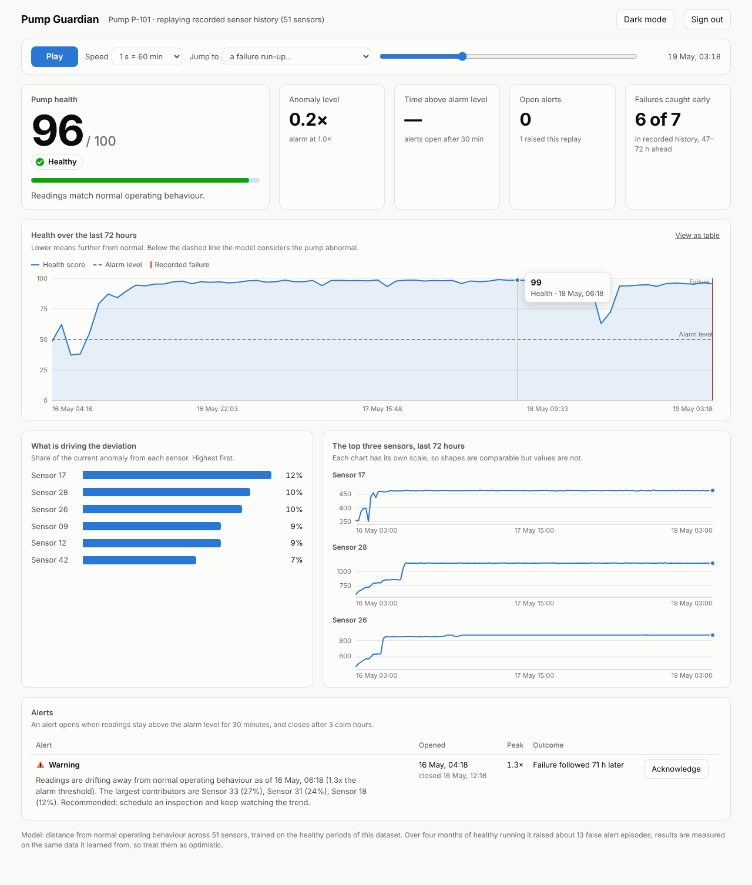

# Pump Guardian



Predictive-maintenance dashboard for oil & gas pumps. Learns what healthy operation looks like from
51 sensors, scores every reading, and warns before failures.

Stack: React + TypeScript (web), Node + TypeScript (api), Python + scikit-learn + FastAPI (ml).

Dataset: Kaggle "Pump Sensor Data" (`sensor.csv`, place in `ml/data/`, not committed).

## Run

```
# 1. ML service (first time: train)
cd ml && pip install -r requirements.txt
python src/train.py                      # writes ml/artifacts/
uvicorn --app-dir src server:app --port 8000

# 2. API
cd api && cp .env.example .env && npm install && npm run dev
#    :4000. Without MONGODB_URI it uses an in-memory store (data lost on restart).
#    First start creates an admin from ADMIN_USER / ADMIN_PASS (default operator / pumps123).

# 3. Dashboard
cd web && npm install && npm run dev     # :5173, proxies /api and /ws to :4000
```

## Model results (honest numbers)

Mahalanobis distance (Ledoit-Wolf) on 51 scaled sensors, 30-minute smoothing, alarm at the 99th
percentile of healthy training data. Alerts open after 30 consecutive minutes above threshold.
Detects 6 of 7 recorded failures 47-72h ahead (look-back capped at 72h); the 25 July failure
is missed. About 16 alerts open during healthy operation over four months.
Threshold and training data come from the same period, so treat results as optimistic.

## MongoDB / Atlas

1. Create a free cluster at cloud.mongodb.com, add a database user, and allow your IP in Network Access.
2. Put the connection string in `api/.env` as `MONGODB_URI=...` (never commit it; `.env` is git-ignored).
3. Start the API. Alerts, acknowledgements, users and model runs are now stored in the `pump_guardian` database.
4. Check the Atlas code against your cluster: `cd api && npm run test:atlas` (uses a throwaway database).

Roles: `viewer` (read only), `operator` (replay control, acknowledge alerts), `admin` (also manage users via `POST /api/users`).

Status: work in progress. Next: static demo build for Vercel, MongoDB persistence for alerts and users.
